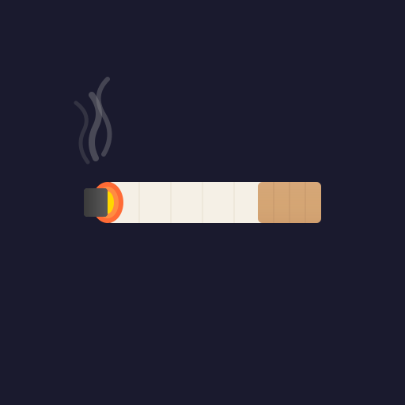

# 🚬 SmokeBot

A Discord bot for coordinating smoke breaks with friends. Built with Cloudflare Workers.



## Features

- `/smoketime` - Initiate a smoke break request
- `/smoketime @user` - Request a smoke break with a specific person
- Interactive button flow: Accept → OTW → Aqui
- "15 Minutes" delay option
- Acknowledgement modal for personalized responses

## Setup

### 1. Create a Discord Application

1. Go to the [Discord Developer Portal](https://discord.com/developers/applications)
2. Click "New Application" and give it a name
3. Go to **Bot** → Click "Reset Token" and save your bot token
4. Go to **General Information** → Copy your Application ID and Public Key
5. Go to **OAuth2** → URL Generator:
   - Select `bot` and `applications.commands` scopes
   - Select desired bot permissions
   - Use the generated URL to invite the bot to your server

### 2. Configure Environment Variables

For local development, create a `.dev.vars` file:

```
DISCORD_PUBLIC_KEY=your_public_key_here
```

For production, set the secret in Cloudflare:

```bash
npx wrangler secret put DISCORD_PUBLIC_KEY
```

### 3. Register Slash Commands

```bash
DISCORD_APP_ID=your_app_id
DISCORD_BOT_TOKEN=your_bot_token
node register.js
```

### 4. Deploy to Cloudflare Workers

```bash
npm install
npx wrangler deploy
```

### 5. Set the Interactions Endpoint URL

1. Copy your Worker URL (e.g., `https://smokebot.your-subdomain.workers.dev`)
2. In Discord Developer Portal → General Information
3. Paste the URL into "Interactions Endpoint URL"
4. Discord will verify the endpoint automatically

## Development

```bash
# Install dependencies
npm install

# Run locally
npx wrangler dev

# Deploy
npx wrangler deploy
```

## Project Structure

```
smokebot/
├── src/
│   └── index.js      # Main worker code
├── register.js       # Slash command registration script
├── wrangler.toml     # Cloudflare Workers config
├── package.json
└── .env.example      # Environment variables template
```

## License

MIT
